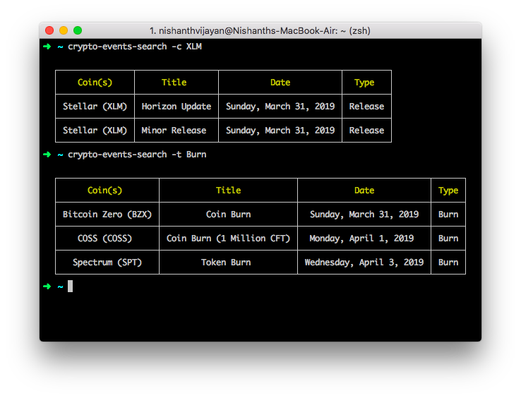

# crypto-events-search

 

## Installation
  
[Register a developer account](https://coinmarketcal.com/en/developer/register) at CoinMarketCal to get your API Key.
```
npm install -g crypto-events-search
crypto-events-search --config YOUR_API_KEY
```
  
## Usage

Note: Coin symbols and event types case-insensitive.  
  
### Search events of a specific coin
```
crypto-events-search -c OMG
```  
  
  
### Search events of multiple coins
```
crypto-events-search -c ETH,XMR,MANA
```
  
  
### List different types of events
The types returned in this command can be used to filter what type of events you're searching for.  
```
crypto-events-search -l
```

### Search events of a particular type
```
crypto-events-search -c etc,xmr,mana -t burn,roadmap
```
